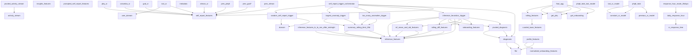

# br

```mermaid
graph TD
activity_stream
pivoted_activity_stream
pivoted_activity_stream-->activity_stream
fhir
diagnoses
diagnoses-->fhir
pivoted_diagnosis
pivoted_diagnosis-->diagnoses
user_domain
fhir
inference_features
inference_features_ts_to_sec_after_midnight
inference_features_ts_to_sec_after_midnight-->inference_features
insights_features
fhir
normalized_onboarding_features
profile_features
profile_features-->normalized_onboarding_features
profile_features-->fhir
onboarding_features
prompted_self_report_features
inference_features
inference_features_ts_to_sec_after_midnight
inference_features_ts_to_sec_after_midnight-->inference_features
summary_rolling_ttest_28d
summary_rolling_ttest_28d-->inference_features
inf_mean_and_std_features
inf_mean_and_std_features-->inference_features
rolling_diff_features
rolling_diff_features-->inference_features
self_report_features
phq_sr
phq_sr-->self_report_features
columbia_sr
columbia_sr-->self_report_features
gad_sr
gad_sr-->self_report_features
altman_sr
altman_sr-->self_report_features
metadata
summary_rolling_ttest_28d
summary_rolling_ttest_28d-->inference_features
too_many_anomalies_trigger
too_many_anomalies_trigger-->summary_rolling_ttest_28d
largest_anomaly_trigger
largest_anomaly_trigger-->summary_rolling_ttest_28d
pivoted_diagnosis
pivoted_diagnosis-->diagnoses
inference_features
onboarding_features
inf_mean_and_std_features
inf_mean_and_std_features-->inference_features
rolling_diff_features
rolling_diff_features-->inference_features
inference_heuristics_trigger
inference_heuristics_trigger-->inference_features
inference_heuristics_trigger-->inf_mean_and_std_features
inference_heuristics_trigger-->rolling_diff_features
inference_heuristics_trigger-->onboarding_features
inference_heuristics_trigger-->pivoted_diagnosis
diagnoses
diagnoses-->fhir
self_report_features
largest_anomaly_trigger
largest_anomaly_trigger-->summary_rolling_ttest_28d
too_many_anomalies_trigger
too_many_anomalies_trigger-->summary_rolling_ttest_28d
inference_heuristics_trigger
inference_heuristics_trigger-->inference_features
inference_heuristics_trigger-->inf_mean_and_std_features
inference_heuristics_trigger-->rolling_diff_features
inference_heuristics_trigger-->onboarding_features
inference_heuristics_trigger-->pivoted_diagnosis
random_self_report_trigger
random_self_report_trigger-->domain
self_report_trigger_orchestrator
self_report_trigger_orchestrator-->random_self_report_trigger
self_report_trigger_orchestrator-->largest_anomaly_trigger
self_report_trigger_orchestrator-->too_many_anomalies_trigger
self_report_trigger_orchestrator-->inference_heuristics_trigger
self_report_trigger_orchestrator-->self_report_features
self_report_trigger_orchestrator-->diagnoses
domain
random_self_report_trigger
random_self_report_trigger-->domain
final_agg
final_agg-->rolling_features
final_agg-->get_phq
final_agg-->get_onboarding
curated_base_features
get_phq
get_onboarding
rolling_features
rolling_features-->curated_base_features
final_agg
final_agg-->rolling_features
final_agg-->get_phq
final_agg-->get_onboarding
user_domain
last_sr
last_sr-->user_domain
last_sr-->self_report_features
prev_phq8
prev_phq8-->self_report_features
prev_gad7
prev_gad7-->self_report_features
prev_altman
prev_altman-->self_report_features
inference_features
self_report_features
phq8_total_last_model
last_sr_model
previous_sr_model
constant_sr_model
constant_sr_model
phq8_total
phq8_total-->constant_sr_model
constant_sr_model
phq8_total
phq8_total-->constant_sr_model
previous_sr_model
phq8_total
phq8_total-->previous_sr_model
sr_response_time
daily_response_hour
daily_response_hour-->sr_response_time
response_hour_mode_28days
response_hour_mode_28days-->daily_response_hour
self_report_features
```
